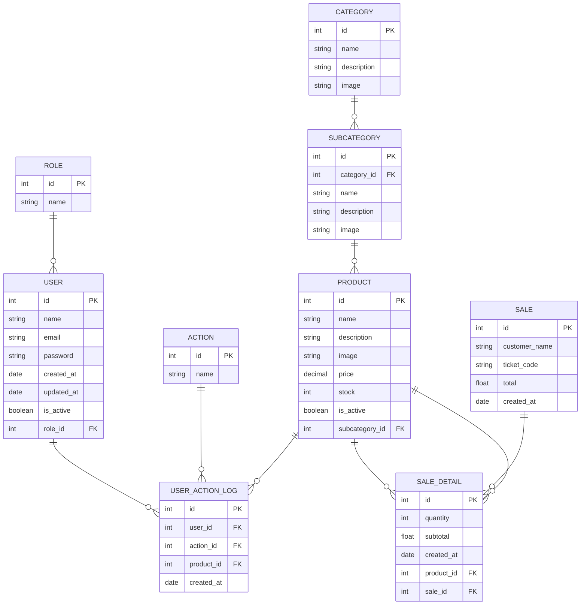

# La vinoteca - Sistema de Autoservicio y Gestión 

Sistema web fullstack para la gestión y venta de productos en una vinoteca. Permite explorar categorías y subcategorías, gestionar productos, realizar compras, emitir tickets PDF y administración segura.

---

## Tecnologías y Dependencias Utilizadas

### Backend
- **Node.js** v22.10.0
- **Express** v5.1.0
- **Sequelize** ORM para SQL
- **MySQL** (desarrollo) / **MySQL** (producción, opcional)
- **jsonwebtoken** (JWT para autenticación)
- **bcryptjs** (hash de contraseñas)
- **nanoid** (generación de códigos únicos)
- **multer** (subida de imágenes)
- **dotenv** (variables de entorno)
- **cors** (CORS middleware)
- **nodemon** (desarrollo)

### Frontend
- **HTML5** y **CSS3**
- **Bootstrap 5** (componentes y utilidades responsivas)
- **Bootstrap Icons**
- **JavaScript Vanilla** (ES6+)
- **jsPDF** (generación de tickets PDF)
- **Live Server** (recomendado para desarrollo)

### Estructura y Utilidades
- **Modularización** de rutas, controladores y modelos
- **Middlewares custom** para autenticación, autorización y uploads
- **Mermaid** (en README para diagramas)

### Otras herramientas
- **VSCode** (recomendado)
- **Postman** o similar para testeo de API

> Para ver todas las dependencias exactas y sus versiones, consulta el archivo `package.json` en la raíz del backend.

---

## Tabla de Contenido
- [Descripción General](#descripción-general)
- [Estructura de Carpetas](#estructura-de-carpetas)
- [Configuración de Variables de Entorno](#configuración-de-variables-de-entorno)
- [Levantando el Proyecto](#levantando-el-proyecto)
- [Scripts Backend](#scripts-backend)
- [Endpoints y API](#endpoints-y-api)
- [Modelo de Datos](#modelo-de-datos)
- [Categorías, Subcategorías, Roles de Usuario y Actions](#categorías-subcategorías-roles-de-usuario-y-actions)

---

## Descripción General

Aplicación web para la gestión de una vinoteca:
- Navegación por categorías y subcategorías de productos
- Carrito de compras y generación de ticket PDF
- Login de administrador y panel de gestión
- Backend Node.js + Express + Sequelize + SQLite
- Frontend HTML, CSS, JS vanilla y Bootstrap

---

## Estructura de Carpetas

```
├── backend
│   ├── controllers
│   ├── repository
│   ├── config
│   ├── middlewares
│   ├── uploads
│   ├── models
│   ├── routes
│   ├── scripts
│   ├── seeders
│   ├── app.js / server.js
│   └── ...
├── frontend
│   ├── assets
│   ├── api
│   ├── components
│   ├── images
│   ├── utils
│   ├── pages
│   │   └── client
│   │   └── admin
│   ├── index.html
│   ├── index.js
│   └── ...
├── .env
├── README.md
└── ...
```

---

## Configuración de Variables de Entorno

Crea un archivo `.env` en la raíz del backend con el siguiente contenido de ejemplo:

```
PORT=3000
DB_NAME=your_db_name
DB_USER=your_db_user
DB_PASS=your_db_password
DB_HOST=127.0.0.1
DB_DIALECT=mysql
JWT_SECRET=your_jwt_secret
IMAGE_PATH='uploads/img'
IMAGE_LOAD='uploads'
```

Ajusta los valores según tu entorno y necesidades.

---

## Levantando el Proyecto

### Backend
1. Instala dependencias:
   ```bash
   npm install
   ```
2. Ejecuta el script de sincronización de la base de datos:
   ```bash
   npm run db:sync
   ```

3. Ejecuta el script de relleno de la base de datos:
   ```bash
   npm run db:seed
   ```

4. Inicia el backend:
   ```bash
   npm run dev
   ```
   El backend corre por defecto en `http://localhost:3000`.

### Frontend
- Abre la carpeta `frontend` y utiliza una extensión como **Live Server** en VSCode, o abre `index.html` directamente en el navegador.
- El frontend consume la API del backend para mostrar productos, categorías, tickets, etc.

---

## Scripts Backend(`backend/scripts`)

- **seed.js**: Rellena la base de datos con datos de ejemplo (categorías, subcategorías, productos, usuarios, etc). Ejecutar con:
  ```bash
  npm run db:seed
  ```
- **drop.js**: Elimina la base de datos. Ejecutar con:
  ```bash
  npm run db:drop
  ```
- **sync.js**: Sincroniza la base de datos con el modelo. Ejecutar con:
  ```bash
  npm run db:sync
  ```

---

## Endpoints y API

A continuación se detallan todos los endpoints disponibles en la API, el método HTTP, la ruta y los middlewares aplicados (autenticación/autorización/subida de archivos):

---

## Ejemplos de Uso de la API

### Autenticación (Login Admin)

**POST /api/auth/login**
```json
// Request
{
  "email": "admin@vinoteca.com",
  "password": "12345678"
}
```
```json
// Response (200)
{
  "message": "Login successful",
  "token": "eyJhbGci...",
  "user": {
    "id": 1,
    "email": "admin@vinoteca.com"
  }
}
```

### Listar categorías
**GET /api/categories**
```json
// Response (200)
[
  {
    "id": 1,
    "name": "Bebidas",
    "description": "Vinos, cervezas y más",
    "image": "uploads/img/bebidas.png"
  },
  ...
]
```

### Listar subcategorías de una categoría
**GET /api/subcategories/1**
```json
// Response (200)
[
  {
    "id": 1,
    "category_id": 1,
    "name": "Vino",
    "description": "Vinos tintos y blancos",
    "image": "uploads/img/vino.png"
  },
  ...
]
```

### Listar productos
**GET /api/products**
```json
// Response (200)
[
  {
    "id": 1,
    "name": "Malbec Reserva",
    "description": "Vino tinto argentino",
    "image": "uploads/img/malbec.png",
    "price": 3500,
    "stock": 15,
    "is_active": true,
    "subcategory_id": 1
  },
  ...
]
```

### Crear producto (requiere token admin y envío de imagen)
**POST /api/products**
- Headers: `Authorization: Bearer <token>`
- Content-Type: `multipart/form-data`
- Campos:
  - name: (string)
  - description: (string)
  - price: (number)
  - stock: (number)
  - subcategory_id: (number)
  - image: (archivo)

```json
// Response (201)
{
  "message": "Producto creado exitosamente",
  "product": {
    "id": 5,
    "name": "Gin Premium",
    ...
  }
}
```

### Registrar venta y generar ticket
**POST /api/ticket**
```json
// Request
{
  "nameCostumer": "Juan Perez",
  "products": [
    { "id": 1, "quantity": 2 },
    { "id": 3, "quantity": 1 }
  ],
  "total": 10500
}
```
```json
// Response (201)
{
  "message": "Venta registrada exitosamente",
  "ticket": {
    "ticket_code": "A1B2C3D4",
    "customer_name": "Juan Perez",
    "total": 10500,
    "created_at": "2025-07-08T00:00:00.000Z",
    "products": [
      { "id": 1, "name": "Malbec Reserva", "quantity": 2, "subtotal": 7000 },
      { "id": 3, "name": "Gin Premium", "quantity": 1, "subtotal": 3500 }
    ]
  }
}
```

### Listar usuarios (solo superadmin)
**GET /api/admin/users**
- Headers: `Authorization: Bearer <token_superadmin>`
```json
// Response (200)
[
  {
    "id": 1,
    "name": "Admin Uno",
    "email": "admin1@vinoteca.com",
    "role_id": 1,
    "is_active": true
  },
  ...
]
```

### Crear usuario admin (solo superadmin)
**POST /api/admin/users**
- Headers: `Authorization: Bearer <token_superadmin>`
```json
// Request
{
  "name": "Nuevo Admin",
  "email": "nuevo@vinoteca.com",
  "password": "12345678",
  "role_id": 1
}
```
```json
// Response (201)
{
  "message": "Administrador creado exitosamente",
  "user": {
    "id": 3,
    "name": "Nuevo Admin",
    "email": "nuevo@vinoteca.com",
    "role_id": 1,
    "is_active": true
  }
}
```

### Listar acciones (actions log, solo superadmin)
**GET /api/admin/actions?page=1**
- Headers: `Authorization: Bearer <token_superadmin>`
```json
// Response (200)
{
  "total": 20,
  "totalPages": 2,
  "currentPage": 1,
  "data": [
    {
      "id": 1,
      "user_id": 1,
      "action_id": 1,
      "product_id": 2,
      "created_at": "2025-07-08T00:00:00.000Z"
    },
    ...
  ]
}
```

---

### Categorías
- `GET /api/categories` — Lista todas las categorías

### Subcategorías
- `GET /api/subcategories` — Lista todas las subcategorías
- `GET /api/subcategories/:category_id` — Lista subcategorías de una categoría

### Productos
- `GET /api/products` — Lista todos los productos
- `GET /api/products/:id` — Detalle de producto
- `POST /api/products` — Crear producto (**Middlewares:** `isAuthenticate`, `isAdmin`, `upload`)
- `PUT /api/products/:id` — Modificar producto (**Middlewares:** `isAuthenticate`, `isAdmin`, `uploadOptional`)
- `PATCH /api/products/:id` — Baja lógica del producto (**Middlewares:** `isAuthenticate`, `isAdmin`)

### Login
- `POST /api/auth/login` — Login de administrador, devuelve JWT

### Tickets/Ventas
- `POST /api/ticket` — Registrar venta y generar ticket
- `GET /api/ticket` — Consultar todos los tickets (**Middlewares:** `isAuthenticate`, `isSuperAdmin`)

### Acciones (Actions)
- `GET /api/admin/actions` — Lista todas las acciones (**Middlewares:** `isAuthenticate`, `isSuperAdmin`)

### Usuarios (Solo SuperAdmin)
- `GET /api/admin/users` — Listar usuarios (**Middlewares:** `isAuthenticate`, `isSuperAdmin`)
- `POST /api/admin/users` — Crear usuario (**Middlewares:** `isAuthenticate`, `isSuperAdmin`)

---

## Middlewares personalizados del backend

El backend implementa los siguientes middlewares para seguridad y manejo de archivos:

- **isAuthenticate:** Verifica que el usuario esté autenticado mediante JWT. Requiere header `Authorization: Bearer <token>`.
- **isAdmin:** Permite acceso a usuarios con rol de Administrador o Super Administrador (`role_id` 1 o 2).
- **isSuperAdmin:** Permite acceso solo a usuarios con rol Super Administrador (`role_id` 2).
- **upload:** Middleware para subir imágenes de producto usando `multer`. Solo permite imágenes JPEG, PNG y GIF.
- **uploadOptional:** Permite modificar productos con o sin imagen nueva (no falla si no se adjunta archivo).

Estos middlewares se aplican en rutas sensibles como la administración de productos, usuarios y acciones, asegurando la protección de los recursos y la integridad de los datos.

---

## Categorías, Subcategorías, Roles de Usuario y Actions

- **Actions:**
  - Crear producto
  - Actualizar o modificar
  - Crear usuario
  - Modificar estado de producto a active
  - Modificar estado de producto a inactive

- **Roles de Usuario:**
  - Administrador
  - Super Administrador

- **Categorías:**
  - Bebidas
  - Accesorios

- **Subcategorías:**
  - Vino
  - Cerveza
  - Vodka
  - Whisky
  - Ron
  - Vasos
  - Copas
  - Kits

---

## Pantallas y Funcionalidades (Frontend)

El sistema cuenta con distintas vistas para usuarios y administradores. A continuación se describen las principales pantallas y su objetivo:

### Página Principal (`index.html`)
- **Propósito:** Bienvenida y acceso al autoservicio.
- **Funcionalidad:** Permite al usuario ingresar su nombre y acceder al catálogo de productos.
- **Componentes:** Logo, saludo, botón de cambio de tema, acceso al catálogo.

### Catálogo de Productos (`pages/client/list/list.html`)
- **Propósito:** Navegación por categorías y subcategorías de productos.
- **Funcionalidad:**
  - Muestra banner y saludo al usuario.
  - Renderiza dinámicamente categorías y subcategorías con imágenes y descripciones.
  - Permite explorar productos por subcategoría.
  - Diseño responsivo para desktop, tablet y mobile.
  - Botones para ver carrito y cancelar compra.
- **Componentes:** Cards de categoría/subcategoría, banner, botones de navegación, footer.

### Carrito de Compras (`pages/client/cart/cart.html`)
- **Propósito:** Visualización y gestión de productos seleccionados.
- **Funcionalidad:**
  - Listado de productos agregados al carrito.
  - Modificar cantidades o eliminar productos.
  - Ver subtotal y total.
  - Botón para finalizar compra.
- **Componentes:** Lista de productos, botones de sumar/restar, resumen de compra.

### Ticket de Compra (`pages/client/ticket/ticket.html`)
- **Propósito:** Mostrar comprobante de compra tras finalizar el pedido.
- **Funcionalidad:**
  - Visualiza detalle de la compra realizada.
  - Permite descargar ticket en PDF.
  - Opción para iniciar una nueva compra.
- **Componentes:** Detalle de productos, datos del cliente, botón de descarga PDF.

### Login de Administrador (`pages/admin/login/login.html`)
- **Propósito:** Acceso seguro para administradores.
- **Funcionalidad:**
  - Formulario de login con validación y feedback de errores.
  - Uso de Bootstrap alerts para mensajes de error.
- **Componentes:** Formulario de login, alertas, footer.

### Panel de Administración
- **Propósito:** Gestión de productos, categorías, ventas y usuarios.
- **Funcionalidad:**
  - Listado, alta, baja y modificación de productos.
  - Visualización de ventas.
  - Listado de las acciones realizadas en el sistema.

### Componentes Reutilizables
- **Footer:** Presente en todas las vistas, con créditos y diseño responsivo.
- **Navbar/Header:** Incluye logo, botones de navegación y cambio de tema.

### Utilidades y Helpers (`frontend/utils`)
- **Funcionalidad:**
  - Manejo de almacenamiento local y carrito.
  - Inclusión dinámica de componentes HTML.
  - Cambio de tema (oscuro/claro).

---
## Modelo de Datos

### Diagrama de Entidad-Relación

