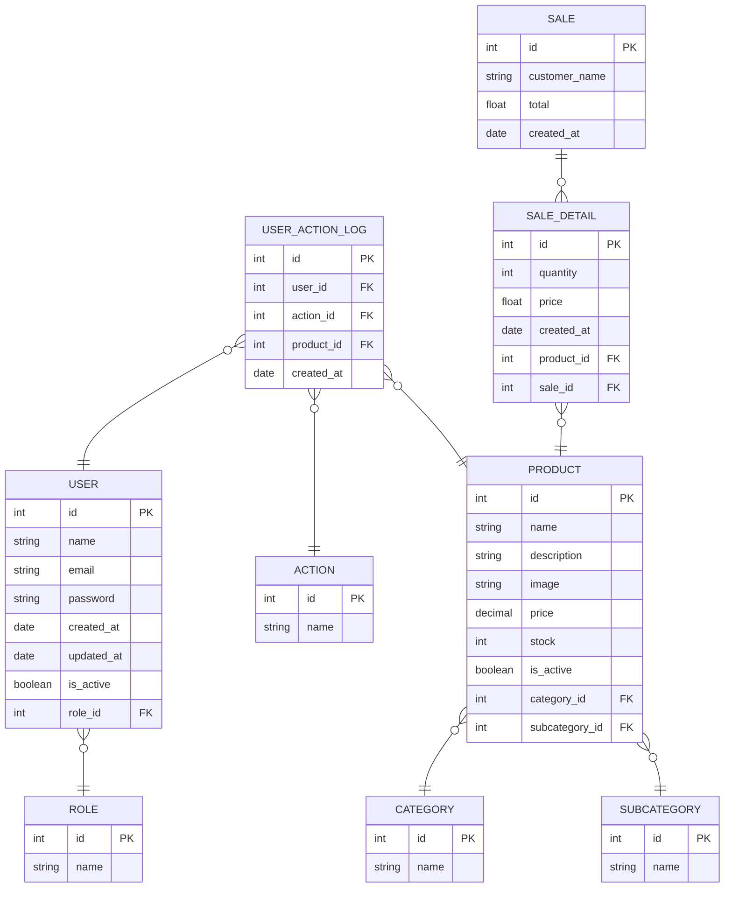

# Modelo de Datos - Tienda

## Diagrama de Entidad-Relación

```mermaid
erDiagram
    PRODUCT {
        int id PK
        string name
        string description
        string image
        decimal price
        int stock
        boolean is_active
        int category_id FK
        int subcategory_id FK
    }
    CATEGORY {
        int id PK
        string name
    }
    SUBCATEGORY {
        int id PK
        string name
    }
    USER {
        int id PK
        string name
        string email
        string password
        date created_at
        date updated_at
        boolean is_active
        int role_id FK
    }
    ROLE {
        int id PK
        string name
    }
    ACTION {
        int id PK
        string name
    }
    USER_ACTION_LOG {
        int id PK
        int user_id FK
        int action_id FK
        int product_id FK
        date created_at
    }
    SALE {
        int id PK
        string customer_name
        float total
        date created_at
    }
    SALE_DETAIL {
        int id PK
        int quantity 
        float price 
        date created_at
        int product_id FK
        int sale_id FK
    }

    PRODUCT }o--|| CATEGORY : ""
    PRODUCT }o--|| SUBCATEGORY : ""
    USER }o--|| ROLE : ""
    USER_ACTION_LOG }o--|| USER : ""
    USER_ACTION_LOG }o--|| ACTION : ""
    USER_ACTION_LOG }o--|| PRODUCT : ""
    SALE ||--o{ SALE_DETAIL : ""
    SALE_DETAIL }o--|| PRODUCT : ""
```